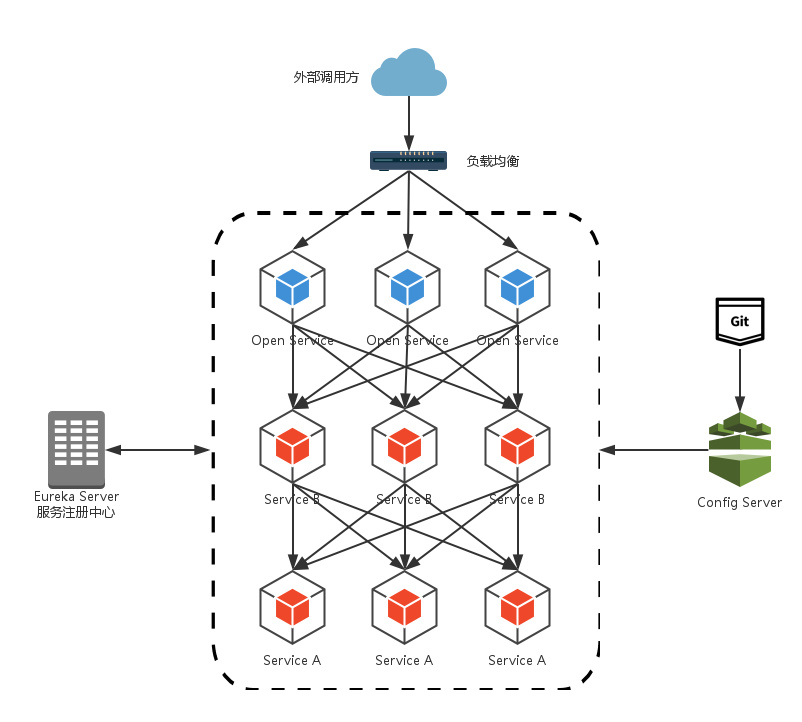
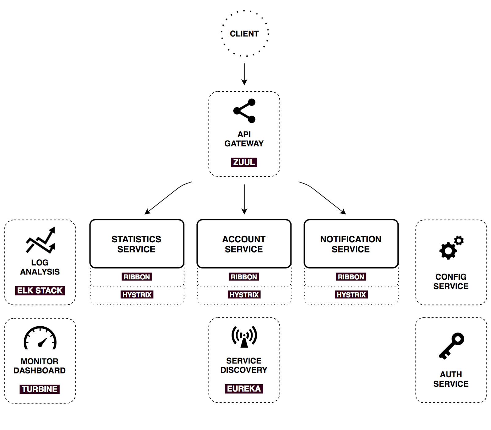

# Spring Cloud Demo
>参考书籍：[《Spring Cloud微服务实战》](http://product.dangdang.com/25061625.html)

## 开发环境：

* JDK 1.8
* Gradle 4.2.1
* Spring Cloud Finchley RC2
* Spring Boot 2.0.2

## eureka-server
>服务注册中心

**核心**：

* eureka -- 服务治理框架 
* 服务注册、服务发现  

**Eureka 结构**：  

* 服务端、客户端  
* 服务端需要高可用<节点互相注册>  

**引用组件**：  

* spring-cloud-starter-netflix-eureka-server

## hello-service
>基于Spring boot搭建的简单service

**引用组件**：

* spring-cloud-starter-netflix-eureka-client  
&emsp;&emsp;>用于向eureka服务端注册自己，以及发送心跳检测/下线，以及通过它发现其他服务以实现服务调用

* spring-cloud-starter-sleuth  
&emsp;&emsp;>用于服务调用链路追踪    

* spring-cloud-starter-zipkin  
&emsp;&emsp;>用于收集各个服务上请求链路的跟踪数据，以实现对服务调用的监控  

* spring-boot-admin-starter-client  
&emsp;&emsp;>将当前服务注册到spring boot admin下，进行统一管理

## ribbon-consumer
>使用Ribbon, 构建消费hello-service的service

**核心**：

Ribbon:

* 基于 HTTP 和 TCP 的客户端负载均衡工具  
* 通过拦截器实现  
* 多种负载均衡策略可选  

Hystrix:

* 断路器、线程隔离
* 服务容错保护
* 服务降级、服务熔断、线程和信号隔离、请求缓存/合并、服务监控(见下hystrix-dashborad & turbine)	

**引用组件**： 

* spring-cloud-starter-netflix-eureka-client  

* spring-cloud-starter-netflix-ribbon  

* spring-cloud-starter-netflix-hystrix  

* spring-boot-admin-starter-client  
&emsp;&emsp;>将当前服务注册到spring boot admin下

## feign-consumer
>使用Feign, 构建消费hello-service的service

**核心**：

Feign:

* 整合 Ribbon 和 Hystrix
* 提供声明式Web服务客户端定义方式

**引用组件**： 

* spring-cloud-starter-netflix-eureka-client

* spring-cloud-starter-openfeign

* spring-cloud-starter-sleuth

* spring-cloud-starter-zipkin

* spring-boot-admin-starter-client

## hystrix-dashboard
>可视化的服务监控Dashboard

**核心**：

* 基于 Hystrix， 监控单个实例
* 通过集成 Turbine 来实现集群监控
* 依靠 Actuator 暴露客户端 Hystrix 接口来采集数据

**引用组件**： 

* spring-cloud-starter-netflix-hystrix

* spring-cloud-starter-netflix-hystrix-dashboard

## turbine
>用于监控服务集群

**核心**：

* 监控某一集群服务
* 整合 Eureka 客户端以发现服务，然后监控指定服务集群
* 可配合 Hystrix Dashboard 使用

**结构**：  

* 可启动多个 turbine 服务 以构建不同的聚合集群

**引用组件**： 

* turbine: spring-cloud-starter-netflix-turbine

## api-gateway
>API网关服务

**核心**：

Zull:

* 对外暴露服务，统一调度、过滤
* 路由、过滤
* 动态过滤、动态路由

Bus:

* 基于消息中间件(Rabbit/Kafka)的消息总线
* 在服务间传递消息
* 配合 config server 以实现动态刷新所有client的配置

**结构**：  

* 自整合hystrix & ribbon

**引用组件**：  

* spring-cloud-starter-netflix-zuul

* spring-cloud-starter-netflix-eureka-client

* spring-cloud-starter-config  
&emsp;&emsp;>config client, 用于向config server获取/更新外部配置信息

* spring-cloud-starter-bus-amqp  
&emsp;&emsp;>使用消息总线，配合config client以实现动态刷新client端配置

## config-repo
>存放在git上的配置信息

## config-server
>分布式配置中心服务端

**核心**：

* 提供集中化的外部配置支持

**结构**：  

* 服务端 和 客户端
* 服务端会自动读取最新提交的内容
* 客户端不能感知服务端配置的更新，需要手动触发refresh接口(可利用git webhook触发config-server, 配合消息总线)

**引用组件**： 

* spring-cloud-config-server
* spring-cloud-starter-netflix-eureka-client
* spring-cloud-starter-bus-amqp
* spring-boot-admin-starter-client

## rabbitmq-demo
> rabbitmq demo

**引用组件**

* spring-boot-starter-amqp  
&emsp;&emsp;>集成rabbitmq

## stream-hello-service
> 测试 stream 的demo

**核心**

* 支持构建事件(消息)驱动的微服务
* 支持RabbitMQ && Kafka

**引用组件**

* spring-cloud-starter-stream-rabbit

## admin-server
> 用于管理、查看基于spring boot应用的server端

**引用组件**

* spring-boot-admin-starter-server

## 总结

**架构图1:**

**架构图2:**

Spring Cloud基于Spring Boot, 因其自动化配置、快速开发、轻松部署的特性.

整个微服务架构分为内部和外部，分界线是 API 网关(Zull或者Gateway).

内部体系中，最重要的是服务治理框架Eureka，需要高可用的组件(多实例)都需要向它注册.

一个标准的Spring Cloud应用包含两个组件：Eureka Client && Hystrix.  

如依赖其他服务则需要加入Ribbon 或者 Feign.  

如果需要使用消息中间件(如Rabbit/Kafka), 需要引入 Stream.  

如果需要动态更新配置、或者消息总线，则需要Config server && Bus.  

如果需要集中管理、查看应用，则需要加入Spring Boot Admin && Client.

如果需要监控，可使用 Hystrix && Turbine.

所有的监控，都需要引入Actuator暴露对应的接口，以供其他采集程序使用.

如果需要服务调用链路追踪，则需要 Sleuth && Zipkin, 使用Zipkin Server, 实现可视化的监控界面.

需要 Zull(或者 Gateway)充当网关，以实现统一入口，统一调度，请求过滤和路由.

需要Eureka Server, 实现服务治理功能.

除了工具类应用(例如Zipkin Server、Spring Boot Server、Hystrix Dashboard)，基本上都需要高可用.

实现高可用，Eureka Server通过节点互相注册， 而其他应用则通过Eureka来实现基于服务而不是实例的使用.

建议所有应用注册Spring Boot admin，以及加入Sleuth && Zipkin Client， 以及暴露对应接口.

建议所有应用加上安全验证(例如Security).

**工具类应用**

* Spring Boot Admin(配合 admin client)
* Zipkin Server(配合sleuth 和 zipkin client)
* Hystrix Dashboard(配合hystrix && turbine)

